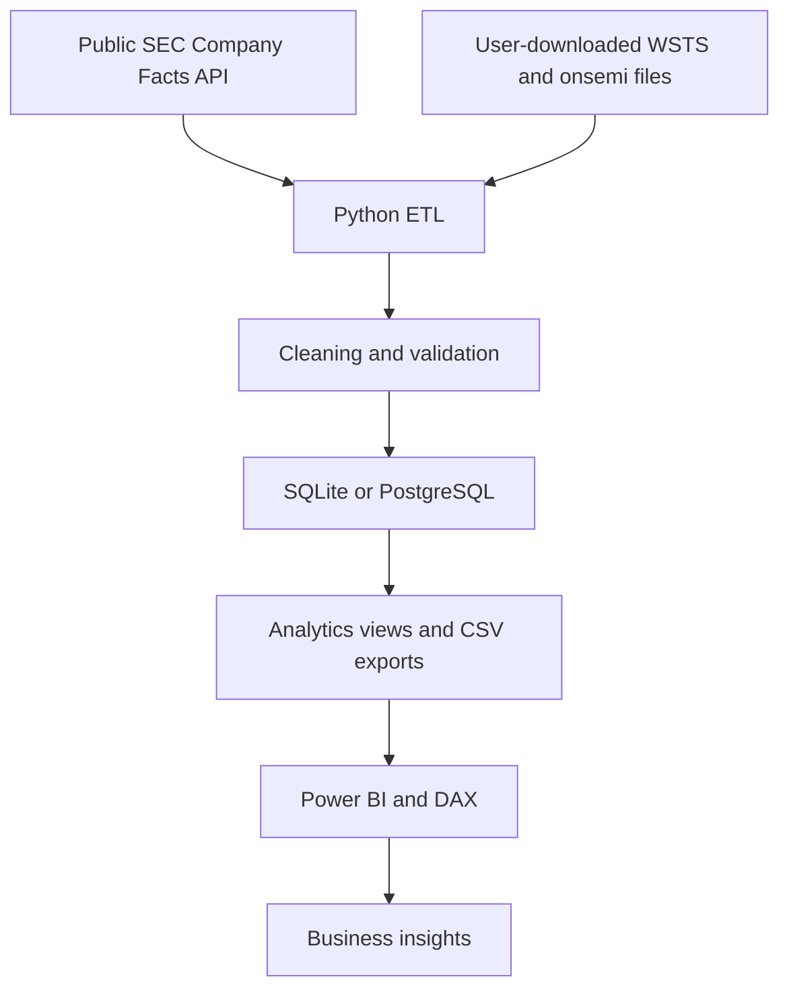

# Chip Market Dashboard

A reproducible analytics project for studying semiconductor market cycles, six public chip companies, and onsemi in detail. Python reads official SEC financial facts, validates fiscal quarters, stores the results in SQL, and exports tables for reporting. Industry data and onsemi end-market disclosures enter through documented local imports. Figures and insights come only from loaded source records.

This project is designed for data analytics, business systems, reporting, and automation roles. It uses plain financial questions: which markets grew, how peers performed, and whether onsemi's margins and growth moved with the broader market.

## Architecture



## Questions answered

- How do semiconductor billings change by month and region when a WSTS file is supplied?
- How do onsemi's quarterly revenue, margins, and R&D compare with NVIDIA, AMD, Intel, Texas Instruments, and Micron?
- How does onsemi's year-over-year growth compare with a peer median and a matched three-month industry window?
- What are Automotive and Industrial shares when a cited onsemi end-market breakout is available?

## Sources and lineage

| Source | Records | Status |
|---|---|---|
| [SEC Company Facts API](https://www.sec.gov/search-filings/edgar-application-programming-interfaces) | US GAAP revenue, profit, R&D, assets, cash, period and filing date | Live API, cached under `data/raw/sec/` |
| [WSTS Historical Billings Report](https://www.wsts.org/67/Historical-Billings-Report) | Monthly industry billings by region | Download and tidy locally; no values bundled |
| [onsemi investor relations](https://investor.onsemi.com/) | End-market revenue breakout, when disclosed | Optional cited CSV; no values bundled |
| Python and DAX | Growth, margins, rolling averages, comparisons | Derived from source rows |

The SEC says its API needs responsible access and caps automated traffic at 10 requests per second. This project sends a contact-bearing User-Agent, caches responses for seven days, retries transient errors, and spaces company requests. See [SEC developer resources](https://www.sec.gov/about/developer-resources).

## Technologies

Python 3.12+, pandas, requests, SQLAlchemy, SQLite or PostgreSQL, pytest, Excel/CSV, Power Query, Power BI, DAX, and Jupyter.

## Setup

```bash
cd semiconductor-market-intelligence
python3.12 -m venv .venv
source .venv/bin/activate
pip install -r requirements.txt
cp .env.example .env
```

Edit `.env`: set `SEC_USER_AGENT` to your name and email, such as `Jane Doe jane@example.com`. The SEC request will stop with a clear error if this value is absent. SQLite is the default. To use PostgreSQL, set `DATABASE_URL` to a SQLAlchemy PostgreSQL URL and install an appropriate driver such as `psycopg[binary]` separately.

```bash
python -m src.pipeline
python -m scripts.resume_metrics
pytest -q
```

`python -m src.pipeline --refresh` bypasses a fresh SEC cache. A failed live request may use an older local response and logs that choice. The command writes `data/processed/quality_summary.json`, a SQL database, and CSV exports. Copy WSTS and optional onsemi data into `data/raw/industry/` using [these import instructions](data/raw/industry/README.md), then rerun the pipeline. Never commit raw SEC responses, WSTS files, exports, or databases.

## Database and calculations

Three dimensions describe companies, observed dates, and regions. Three fact tables store company fiscal quarters, industry region-month sales, and optional onsemi end-market disclosures. [Schema](sql/schema.sql) and [views](sql/views.sql) are included. SQLite works locally; `DATABASE_URL` selects PostgreSQL when available.

The Python modules have focused jobs: `fetch_sec.py` handles API requests and caching; `load_industry.py` and `segments.py` read public files; `clean_financials.py` normalizes SEC facts; `transform.py` validates rows; `database.py` loads SQL tables; `metrics.py` and `analysis.py` calculate measures; and `export_powerbi.py` writes reporting exports. `pipeline.py` runs those steps in order. Shared settings and source mappings live in `config.py`.

The pipeline prefers directly reported 10-Q quarters. It derives Q4 from a 10-K annual amount only if the three earlier quarters for that metric are present. It does not replace missing values with zero. Growth calculations require an actual matching prior fiscal quarter or region-month. Margins divide profit by revenue only when revenue is nonzero. Company fiscal quarters and WSTS calendar months are different time grains; the onsemi industry comparison export requires full three-month windows and a nearby month end.

## Reporting output

The pipeline writes SQL views and CSV exports to `data/exports/` for analysis and reporting. The Power BI report is maintained separately by the project owner.

## Data quality and reproducibility

Tests cover duplicate company periods, missing keys, invalid quarters, negative sales, company CIK mappings, end-market percentage ranges, quarter derivation, and growth formulas. Run `pytest -q` after any change. Every ETL run validates records before the database refresh and writes a count-based quality report after export.

The [source validation snapshot](docs/SOURCE_VALIDATION.md) checks selected loaded values against a SEC 10-Q, SEC 10-K, and SIA's WSTS-based monthly release.

The [exploratory notebook](notebooks/exploratory_analysis.ipynb) reads only generated CSVs and skips unavailable industry sections. The [resume metrics file](docs/RESUME_METRICS.md) is generated from the code and latest successful run, so project counts can be quoted without invented impact percentages.

## Limits

The WSTS publication is downloaded by the user and should not be republished from this repository. Its downloaded workbook may need a one-time Power Query reshape into the documented tidy format. Its sales unit must be checked before comparing dollar amounts. SEC Company Facts is not a complete segment database; Automotive and Industrial exposure is shown only from a cited onsemi breakout. Peer fiscal calendars differ, SEC concepts may change over time, and the matched onsemi versus industry chart is descriptive, not causal.
