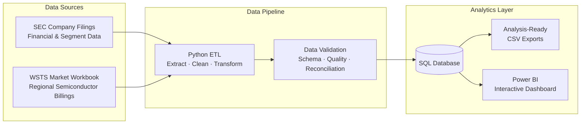

<h1 align="center">Chip Market Insights</h1>

<p align="center">Global semiconductor sales, regional trends, and company financials.</p>
<!--
<p align="center"><a href="powerbi/Chip-Market-Dashboard.pbix">Open the Power BI report</a> · <a href="powerbi/Chip-Market-Dashboard.pdf">View the PDF preview</a></p>
-->

<table>
  <tr>
    <td width="50%"></td>
    <td width="50%"></td>
  </tr>
  <tr>
    <td align="center">Industry overview</td>
    <td align="center">Company analysis</td>
  </tr>
</table>

<br>

Chips keep making the news, but the headlines rarely show how the whole market has changed. I built this dashboard to follow global sales, see which regions are growing, and compare the financial trends of six chip companies. It combines public WSTS market data with SEC filings. Python cleans and checks the data, SQL organizes it, and Power BI makes the trends easier to explore.

<br>

## How it works



## What the report shows

- **Industry overview:** Historical worldwide sales, regional market size, and growth over time.
- **Company analysis:** Revenue trends, margins, and R&D spending for onsemi, NVIDIA, AMD, Intel, Texas Instruments, and Micron. These companies serve different markets, so their figures need business context.

The [Power BI file](powerbi/Chip-Market-Dashboard.pbix) contains the report. The [two-page PDF](powerbi/Chip-Market-Dashboard.pdf) is a quick preview that opens without Power BI Desktop.

## Run the data pipeline

You need Python 3.12 or newer. Run each command in order from a terminal.

**1. Clone the repository.**

```bash
git clone https://github.com/YB-Yottabyte/chip-market-insights.git
```

```bash
cd chip-market-insights
```

**2. Set up Python.** On macOS or Linux:

```bash
python3.12 -m venv .venv
```

```bash
source .venv/bin/activate
```

On Windows PowerShell, use these two commands instead:

```powershell
py -3.12 -m venv .venv
```

```powershell
.\.venv\Scripts\Activate.ps1
```

```bash
python -m pip install -r requirements.txt
```

**3. Add your SEC contact.** Copy the example settings:

```bash
cp .env.example .env
```

On Windows PowerShell, use:

```powershell
Copy-Item .env.example .env
```

Open `.env` and replace the example `SEC_USER_AGENT` with your name and email. The SEC requires a contact for automated requests. The file stays on your computer.

**4. Add the WSTS market data workbook.**

The industry-level market charts use data from the **WSTS Historical Billings Report**.

1. Go to the [WSTS Historical Billings Report](https://www.wsts.org/67/Historical-Billings-Report).
2. Download the historical billings Excel workbook.
3. Place the downloaded file in:

   `data/raw/industry/`

You do **not** need to rename the workbook if its format is supported. See [`data/raw/industry/README.md`](data/raw/industry/README.md) for the accepted filenames and formats.

> **Note:** The application can still load and analyze company financial data without the WSTS workbook. However, industry/market-level charts will not be available until the workbook is added.

**5. Run the pipeline.**

```bash
python -m src.pipeline
```

To update the measured project statistics after a run:

```bash
python -m scripts.resume_metrics
```

The pipeline caches SEC responses and writes a quality summary after each run. Use `python -m src.pipeline --refresh` when you want fresh SEC responses.

## Data and outputs

| Input | Source |
| --- | --- |
| Company financials | [SEC Company Facts API](https://www.sec.gov/search-filings/edgar-application-programming-interfaces), downloaded by the pipeline |
| Monthly market sales | [WSTS historical workbook](https://www.wsts.org/67/Historical-Billings-Report), added locally |
| onsemi end-market records | [Cited public disclosures](data/reference/onsemi_end_markets.csv) for the available periods |

| Output | Where to find it |
| --- | --- |
| Power BI report and PDF preview | [powerbi/](powerbi/) |
| SQL database and quality summary | `data/processed/` after a run |
| Reporting tables and calculated metrics | `data/exports/` after a run |

Generated data stays out of Git. The [SQL queries](sql/analytics_queries.sql) and [analysis notebook](notebooks/exploratory_analysis.ipynb) show how to explore the results.

## Data Summary

The latest recorded run loaded **388 company quarters** across **6 companies** and **2,435 industry region-month records**, with all quality checks passing. Because source data can change, rerun the pipeline to obtain current counts. See the [measured statistics](docs/RESUME_METRICS.md) and [source audit](docs/SOURCE_VALIDATION.md).

The **WSTS workbook is downloaded separately** and is required for market-level charts. The PBIX also retains a **Power BI Service dataset connection**, so refreshing it may require dataset access.

Coverage varies by source: company fiscal calendars differ, some filings omit certain metrics, and onsemi end-market figures are included only where disclosures are available. Trends shown in the analysis indicate relationships in the data, not necessarily causation.
