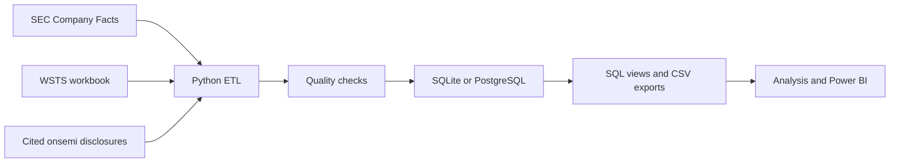

<h1 align="center">Chip Market Dashboard</h1>

<p align="center">Semiconductor market trends and company financials, with a closer look at onsemi.</p>

---

<table>
  <tr>
    <td width="50%"></td>
    <td width="50%"></td>
  </tr>
  <tr>
    <td align="center">Industry overview</td>
    <td align="center">Company analysis</td>
  </tr>
</table>

## Why I built this

Chips are hard to miss in the news in 2026. An [AP story about TSMC expanding chip production](https://apnews.com/article/ba05b1b952257d371acb9d070e7914ff) made me wonder what the wider industry looked like over time. How much had chip sales grown? Which regions drove the changes? And how did onsemi perform during those shifts?

I built this project to answer those questions with public data. It combines SEC financial filings for six chip companies with monthly industry data from WSTS. Python checks and prepares the data, SQL stores it, and Power BI helps show the trends. The companies are viewed in the context of their different businesses.

## What the dashboard explores

- Global and regional semiconductor sales over time.
- Revenue, margins, and R&D for onsemi, NVIDIA, AMD, Intel, Texas Instruments, and Micron.
- onsemi's growth alongside wider market trends and its cited end-market mix.

## How the data moves



## Run the project

### 1. Clone the repository

You need Python 3.12 or newer and internet access for the first SEC download.

```bash
git clone https://github.com/YB-Yottabyte/chip-market-insights.git
cd chip-market-insights
```

### 2. Install the packages

On macOS or Linux:

```bash
python3.12 -m venv .venv
source .venv/bin/activate
python -m pip install -r requirements.txt
```

On Windows PowerShell:

```powershell
py -3.12 -m venv .venv
.\.venv\Scripts\Activate.ps1
python -m pip install -r requirements.txt
```

### 3. Set your SEC contact

Copy `.env.example` to `.env`. Use `cp .env.example .env` on macOS or Linux, or `Copy-Item .env.example .env` in PowerShell. Add your own name and email:

```dotenv
SEC_USER_AGENT=Your Name you@example.com
DATABASE_URL=sqlite:///data/processed/semiconductor.db
SEC_CACHE_DAYS=7
SEC_TIMEOUT_SECONDS=30
```

The SEC uses this contact to identify automated requests. The app reads `.env` automatically, and Git ignores it. SQLite is the default database.

### 4. Add the industry file

Download the XLSX file from the [WSTS Historical Billings Report](https://www.wsts.org/67/Historical-Billings-Report) and place the original workbook in `data/raw/industry/`. The loader reads it directly. The [input notes](data/raw/industry/README.md) explain other accepted files.

The company data can load without this workbook. Market charts and onsemi-to-industry comparisons need it.

### 5. Run and check the pipeline

```bash
python -m src.pipeline
python -m pytest -q
python -m scripts.resume_metrics
```

The pipeline caches SEC responses, validates the rows, updates `data/processed/semiconductor.db`, and writes CSV files to `data/exports/`. Read `data/processed/quality_summary.json` for the checks and row counts. Use `python -m src.pipeline --refresh` to request fresh SEC responses.

After a successful run, open [exploratory_analysis.ipynb](notebooks/exploratory_analysis.ipynb) with `jupyter lab` to explore the exported data. To use PostgreSQL, set `DATABASE_URL` to a SQLAlchemy PostgreSQL URL and install a compatible driver.

## Data and outputs

| Source | Used for |
| --- | --- |
| [SEC Company Facts API](https://www.sec.gov/search-filings/edgar-application-programming-interfaces) | Company revenue, profit, R&D, assets, cash, and filing dates |
| [WSTS Historical Billings Report](https://www.wsts.org/67/Historical-Billings-Report) | Monthly semiconductor sales by region |
| [Cited onsemi disclosures](data/reference/onsemi_end_markets.csv) | Available Automotive, Industrial, and Other end-market data |

The main exports are `vw_company_financials.csv`, `vw_market_sales.csv`, `company_metrics.csv`, `market_metrics.csv`, and `onsemi_industry_comparison.csv`. All are written to `data/exports/`. The [SQL schema](sql/schema.sql), [views](sql/views.sql), and [example queries](sql/analytics_queries.sql) show how the database is organized.

The pipeline uses reported 10-Q quarters when possible. It calculates Q4 from a 10-K only when the first three quarters are available. Missing amounts stay missing. Growth rates require a matching earlier period, and the onsemi-to-industry comparison uses complete three-month market windows.

## Verified run

The September 22, 2026 (UTC) run loaded **388 company quarters** from **6 companies** and **2,435 industry region-month rows**. It produced **60 onsemi-to-industry growth comparisons**. All quality checks and **26 tests** passed. These counts can change when the sources update. See the [measured project statistics](docs/RESUME_METRICS.md) and [source checks](docs/SOURCE_VALIDATION.md).

## Repository map

```text
src/        Data collection, cleaning, validation, database loading, and analysis
sql/        Schema, views, and queries
tests/      Unit and database integration tests
notebooks/  Exploratory analysis
data/       Public reference rows and local input/output folders
docs/       Source checks, metrics, and report screenshots
powerbi/    Existing Power BI support files
```

## Limits

The WSTS workbook is downloaded separately and is not republished here. Company fiscal calendars differ, so quarter labels may cover different dates. SEC data does not provide a complete onsemi end-market history. The onsemi and industry growth comparison shows timing, not causation.
