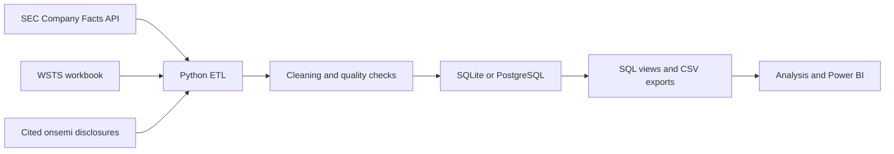

# Chip Market Dashboard

Chips seem to be in the news all the time in 2026. After reading about [changes in global semiconductor sales](https://www.semiconductors.org/global-semiconductor-sales-increase-6-4-month-to-month-in-july/), I wanted to look beyond one month's headline. How has the market changed over the years? Which regions have driven growth? And how has onsemi performed during those shifts?

I built Chip Market Dashboard to explore those questions with public data. It brings together monthly industry sales and financial filings for onsemi and five other chip companies. Python and SQL clean, check, and organize the data for analysis and Power BI. The project focuses on market trends, company context, and onsemi's place in the wider industry.

## What this project answers

- How have semiconductor sales changed over time and across regions?
- How have revenue, margins, and R&D changed for six public chip companies?
- How has onsemi performed during broader industry growth or contraction?
- What do cited onsemi disclosures say about its Automotive and Industrial exposure?

## Data flow



## Run it yourself

### 1. Clone the repository

You need Python 3.12 or newer and internet access for the SEC API. Power BI Desktop is only needed if you want to connect the outputs to a local report.

```bash
git clone https://github.com/YB-Yottabyte/chip-market-insights.git
cd chip-market-insights
```

### 2. Install Python packages

On macOS or Linux:

```bash
python3.12 -m venv .venv
source .venv/bin/activate
python -m pip install -r requirements.txt
```

On Windows PowerShell:

```powershell
py -3.12 -m venv .venv
.\.venv\Scripts\Activate.ps1
python -m pip install -r requirements.txt
```

### 3. Add your SEC contact

Copy `.env.example` to `.env`. Use `cp .env.example .env` on macOS or Linux, or `Copy-Item .env.example .env` in PowerShell. Then set `SEC_USER_AGENT` to your own name and email:

```dotenv
SEC_USER_AGENT=Your Name you@example.com
DATABASE_URL=sqlite:///data/processed/semiconductor.db
SEC_CACHE_DAYS=7
SEC_TIMEOUT_SECONDS=30
```

The SEC requires an identifying User-Agent for automated requests. The app reads `.env` automatically. `.env` is ignored by Git.

### 4. Download the industry workbook

Download the XLSX file from the [WSTS Historical Billings Report](https://www.wsts.org/67/Historical-Billings-Report). Put the original workbook in `data/raw/industry/`. The loader reads its `Monthly Data` and `3MMA` sheets directly; no spreadsheet editing is needed. See the [industry input instructions](data/raw/industry/README.md) for other accepted files.

The repository does not distribute the WSTS workbook. If you skip this step, the company financial pipeline still runs, but market tables and onsemi-to-industry comparisons will be empty.

### 5. Run the pipeline

From the repository root, with the virtual environment active:

```bash
python -m src.pipeline
```

The command downloads or reuses cached SEC responses, reads the WSTS workbook, checks the records, refreshes the SQL database, and writes CSV exports. The default database is `data/processed/semiconductor.db`.

To request fresh SEC responses even when the local cache is current:

```bash
python -m src.pipeline --refresh
```

### 6. Check the results

```bash
python -m pytest -q
python -m scripts.resume_metrics
```

Read `data/processed/quality_summary.json` for the checks and row counts. The generated tables are in `data/exports/`. The second command updates [resume metrics](docs/RESUME_METRICS.md) from the latest successful run.

For exploratory charts, start `jupyter lab` and open [exploratory_analysis.ipynb](notebooks/exploratory_analysis.ipynb) after running the pipeline.

## What the pipeline creates

| Output | Purpose |
| --- | --- |
| `data/raw/sec/*.json` | Cached SEC Company Facts responses |
| `data/processed/semiconductor.db` | Local SQLite database |
| `data/processed/quality_summary.json` | Validation results and source counts |
| `data/exports/vw_company_financials.csv` | Company quarters with financial statement values |
| `data/exports/vw_market_sales.csv` | Monthly semiconductor sales by region |
| `data/exports/company_metrics.csv` | Company growth, margins, and R&D intensity |
| `data/exports/market_metrics.csv` | Market growth, rolling sales, and regional contribution |
| `data/exports/onsemi_industry_comparison.csv` | Matched onsemi and industry growth observations |

The pipeline also exports the six dimension and fact tables and calculated insight files. Raw downloads, the local database, exports, and `.env` are excluded from Git.

## Data and calculations

| Source | Use |
| --- | --- |
| [SEC Company Facts API](https://www.sec.gov/search-filings/edgar-application-programming-interfaces) | Revenue, profit, R&D, assets, cash, fiscal periods, and filing dates for onsemi, NVIDIA, AMD, Intel, Texas Instruments, and Micron |
| [WSTS Historical Billings Report](https://www.wsts.org/67/Historical-Billings-Report) | Monthly semiconductor billings and three-month averages by region |
| [Cited onsemi disclosures](data/reference/onsemi_end_markets.csv) | Available Automotive, Industrial, and Other end-market observations |

SEC responses are cached for seven days by default. The client uses an identifying User-Agent, retry handling, and spaced requests. The WSTS loader converts the workbook's stated `1000 US$` amounts to USD.

The financial normalizer uses reported 10-Q quarters when available. It derives Q4 from the 10-K annual value only when Q1 through Q3 values for that metric are present. Missing amounts stay missing. Growth rates require a real prior period, and margins use nonzero revenue as the denominator. The onsemi-to-industry comparison uses complete three-month market windows near onsemi's fiscal quarter ends.

The database has company, date, and region dimensions plus company financial, market, and onsemi end-market fact tables. See the [SQL schema](sql/schema.sql), [views](sql/views.sql), and [example queries](sql/analytics_queries.sql). Set `DATABASE_URL` in `.env` to use PostgreSQL; install a compatible PostgreSQL driver separately.

The existing Power BI report is maintained separately. This repository provides its SQL and CSV data sources.

## Verified run snapshot

The local run on September 22, 2026 (UTC) processed **6 companies**, **388 company quarters**, and **2,435 industry region-month rows**. It produced **60 matched onsemi-to-industry growth comparisons**. All data-quality checks passed, and **26 tests** passed. These counts are a snapshot; a new SEC filing or WSTS workbook can change them. See [resume metrics](docs/RESUME_METRICS.md) and the [source validation notes](docs/SOURCE_VALIDATION.md).

## Project layout

```text
src/        SEC collection, file imports, cleaning, validation, SQL loading, and analysis
sql/        Reference schema, reporting views, and example queries
tests/      Unit and database integration tests
notebooks/  Exploratory analysis using generated exports
data/       Public reference rows and ignored local inputs and outputs
docs/       Source checks and measured project statistics
powerbi/    Existing Power BI support files
```

## Limits

The WSTS workbook must be downloaded by each user and is not republished here. Company fiscal calendars differ, so equal fiscal-quarter labels do not always mean identical calendar dates. SEC Company Facts does not provide a complete end-market history; onsemi exposure is included only when a cited public disclosure supports it. The onsemi and industry growth comparison describes timing, not causation.
