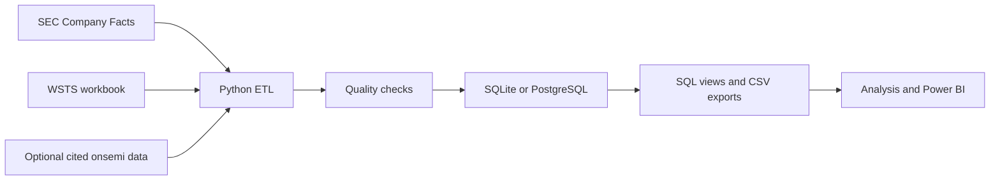

<h1 align="center">Chip Market Dashboard</h1>

<p align="center">Semiconductor sales, regional trends, and financial performance across six chip companies.</p>

<table>
  <tr>
    <td width="50%"></td>
    <td width="50%"></td>
  </tr>
  <tr>
    <td align="center">Industry overview</td>
    <td align="center">Company analysis</td>
  </tr>
</table>

Chips are hard to miss in the news in 2026. An [AP story about TSMC expanding chip production](https://apnews.com/article/ba05b1b952257d371acb9d070e7914ff) made me curious about the bigger picture: how global sales changed over time, which regions grew, and how different chip companies performed. This dashboard brings WSTS market data and SEC filings together to explore those questions. Python and SQL prepare the data for analysis in Power BI.

## How the data moves



## Run the project

### 1. Clone the repository

You need Python 3.12 or newer and internet access for the first SEC download.

```bash
git clone https://github.com/YB-Yottabyte/chip-market-insights.git
cd chip-market-insights
```

### 2. Install the packages

On macOS or Linux:

```bash
python3.12 -m venv .venv
source .venv/bin/activate
python -m pip install -r requirements.txt
```

On Windows PowerShell:

```powershell
py -3.12 -m venv .venv
.\.venv\Scripts\Activate.ps1
python -m pip install -r requirements.txt
```

### 3. Set your SEC contact

Copy `.env.example` to `.env`. Use `cp .env.example .env` on macOS or Linux, or `Copy-Item .env.example .env` in PowerShell. Add your own name and email:

```dotenv
SEC_USER_AGENT=Your Name you@example.com
DATABASE_URL=sqlite:///data/processed/semiconductor.db
SEC_CACHE_DAYS=7
SEC_TIMEOUT_SECONDS=30
```

The SEC uses this contact to identify automated requests. The app reads `.env` automatically, and Git ignores it. SQLite is the default database.

### 4. Add the industry file

Download the XLSX file from the [WSTS Historical Billings Report](https://www.wsts.org/67/Historical-Billings-Report) and place the original workbook in `data/raw/industry/`. The loader reads it directly. The [input notes](data/raw/industry/README.md) explain other accepted files.

The company data can load without this workbook. Market data and cross-market comparisons need it.

### 5. Run and check the pipeline

```bash
python -m src.pipeline
python -m pytest -q
python -m scripts.resume_metrics
```

The pipeline caches SEC responses, validates the rows, updates `data/processed/semiconductor.db`, and writes CSV files to `data/exports/`. Read `data/processed/quality_summary.json` for the checks and row counts. Use `python -m src.pipeline --refresh` to request fresh SEC responses.

After a successful run, open [exploratory_analysis.ipynb](notebooks/exploratory_analysis.ipynb) with `jupyter lab` to explore the exported data. To use PostgreSQL, set `DATABASE_URL` to a SQLAlchemy PostgreSQL URL and install a compatible driver.

## Datasets

| Dataset | How it is added | What it contains |
| --- | --- | --- |
| [SEC Company Facts](https://www.sec.gov/search-filings/edgar-application-programming-interfaces) | Downloaded by the pipeline | Financial data for onsemi, NVIDIA, AMD, Intel, Texas Instruments, and Micron |
| [WSTS Historical Billings Report](https://www.wsts.org/67/Historical-Billings-Report) | Download the XLSX file to `data/raw/industry/` | Monthly semiconductor sales by region |
| [Cited onsemi disclosures](data/reference/onsemi_end_markets.csv) | Included in `data/reference/` | Available Automotive, Industrial, and Other end-market rows |

## Outputs

| File | What it shows |
| --- | --- |
| `data/processed/semiconductor.db` | SQLite tables and reporting views |
| `data/processed/quality_summary.json` | Data checks and row counts from the latest run |
| `data/exports/vw_company_financials.csv` | Company financial records by fiscal quarter |
| `data/exports/vw_market_sales.csv` | Monthly semiconductor sales by region |
| `data/exports/company_metrics.csv` and `market_metrics.csv` | Growth, margins, R&D intensity, and regional measures |
| `data/exports/onsemi_industry_comparison.csv` | Quarters with a matching three-month industry window |

The [SQL schema](sql/schema.sql), [views](sql/views.sql), and [example queries](sql/analytics_queries.sql) show how the database is organized. Missing values stay missing. Growth calculations require an actual earlier period.

## Verified run

The September 22, 2026 (UTC) run loaded **388 company quarters** from **6 companies** and **2,435 industry region-month rows**. All quality checks and **26 tests** passed. These counts can change when the sources update. See the [measured project statistics](docs/RESUME_METRICS.md) and [source checks](docs/SOURCE_VALIDATION.md).

## Repository map

```text
src/        Data collection, cleaning, validation, database loading, and analysis
sql/        Schema, views, and queries
tests/      Unit and database integration tests
notebooks/  Exploratory analysis
data/       Public reference rows and local input/output folders
docs/       Source checks, metrics, and report screenshots
powerbi/    Existing Power BI support files
```

## Limits

The WSTS workbook is downloaded separately and is not republished here. Company fiscal calendars differ, and some SEC values are unavailable. onsemi end-market rows cover only cited periods. Company and industry trends show timing, not causation.
